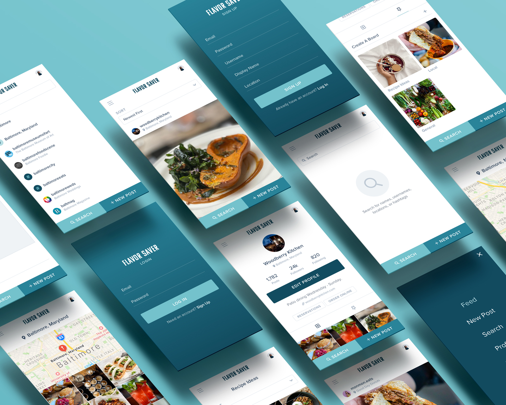

# Flavor Saver
A mobile-first application for posting photos of your food and discovering new food, restaurants, and fellow foodies around your area.

         




## User Story
```
As a foodie
I want to post and tag food photos and follow fellow foodies
So that I can easily discover new food and restaurants
```


## Table of Contents   
* [Screens](#screens) 
* [Credits](#credits) 
* [Donate](#donate)
* [License](#license) 


## Screens
**Invision Prototype:** https://invis.io/4YZ21T4A89R#/434308500_Login


## Credits
A collaboration between Lauren Siminski, Abigail Benjamin, Thomas Coradetti, and Gabriel Nozea. This web application wouldn’t run without: 
* React/JSX
* Express
* MongoDB
* Firebase
* Google Maps
* Heroku


## Donate
Appreciate this code? Say thanks with a coffee:

[](https://ko-fi.com/W7W21YVJJ)


## License
Copyright (c) 2020.